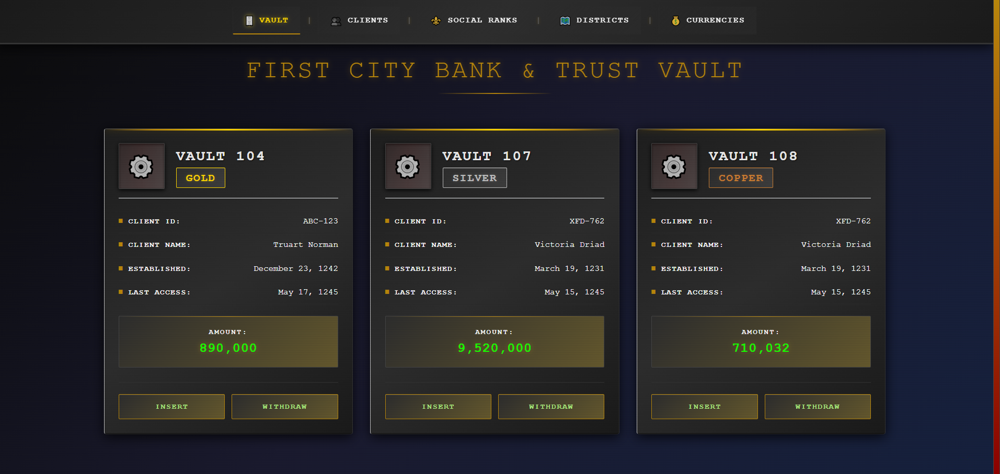
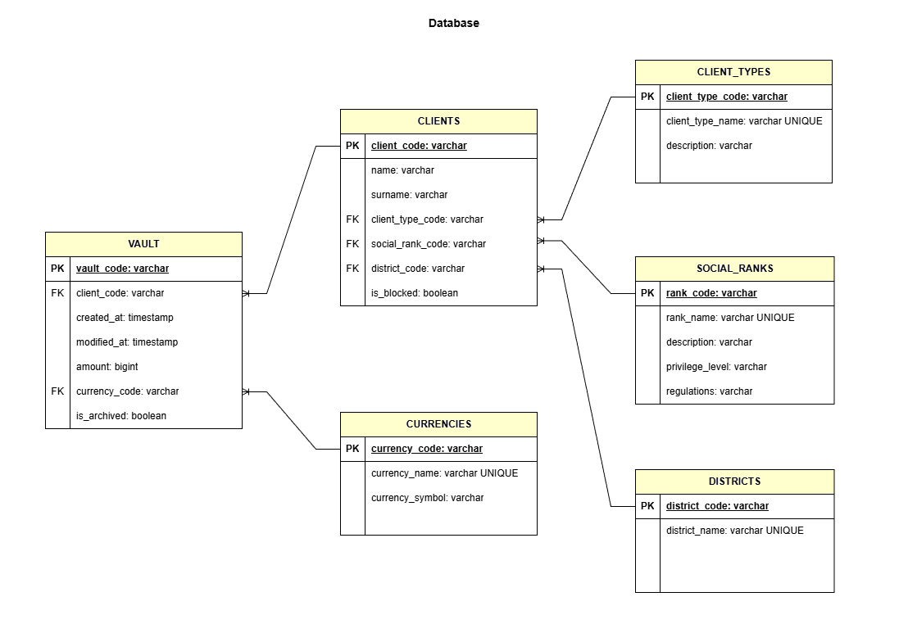
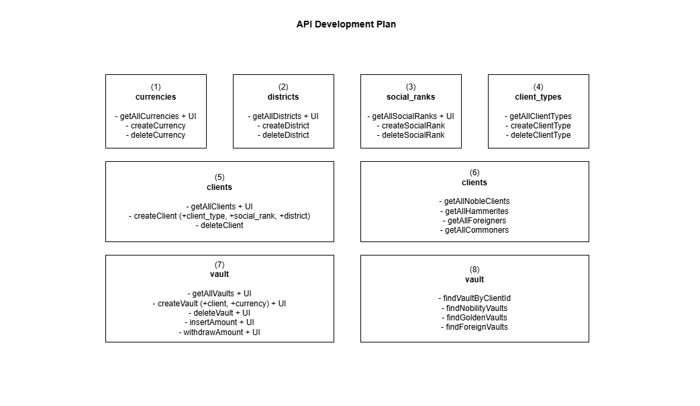

# First City Bank And Trust

> In the Annals of our City, a New Chapter Begins.

## Proclamation of Establishment

By the gracious will of our Baron, and enacted by the wise order of the City Council, a new era of prosperity dawns upon our City. For generations, our commerce has relied on barter and the guarded strongboxes of individual merchants. Those days are now past.

We proudly announce the founding of **First City Bank and Trust**, the first institution of its kind in our long and storied history.

## Our Vision

Imagine a place where your hard-earned coin is guarded by stone walls and unbreakable vows. A place where a single letter of credit can secure a shipment of gold from distant lands, or where a humble artisan can secure the funds to build a workshop that will become a city legacy.

This is the promise of the First City Bank and Trust.

More than a building, it is a symbol of our Baron's faith in his people and a testament to the City's growing prestige. It is the bedrock upon which we will build a safer, wealthier, and more united future for all.

## 🏛️ Founding Principles

*   **Historic First:** The first centralized bank in the City's history.
*   **Council Mandated:** Established by official decree of the City Council.
*   **Baron's Goodwill:** Founded upon the benevolent vision of our Baron.
*   **Unshakeable Trust:** Our name is our bond—the security of your assets is our highest duty.

## 🚀 A New Age of Commerce

Step into a new age of security and opportunity. Your legacy starts here.

---

